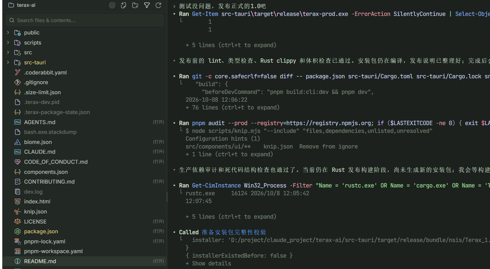
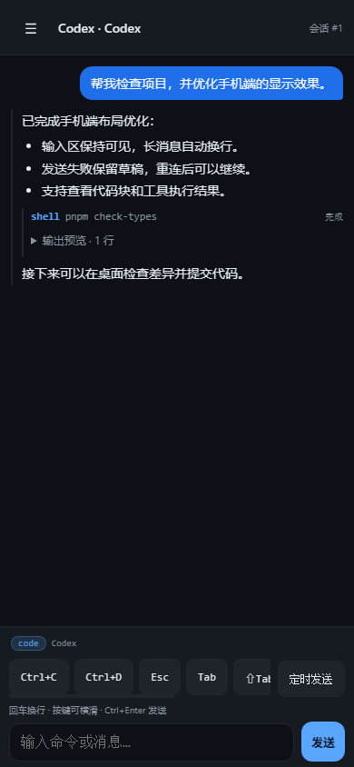

  
  <h1>Terax AI Plus</h1>
  
面向 Claude Code / Codex 开发的轻量终端工作区

  
<a href="https://github.com/zhiweiiii/terax-ai-plus/releases/latest">下载正式版</a> · <a href="docs/README.md">项目文档</a> · <a href="https://github.com/zhiweiiii/terax-ai-plus/issues">反馈问题</a>

把 AI 编码终端、项目文件、代码编辑、Git 和网页预览放进一个窗口。直接使用你熟悉的 Claude Code / Codex CLI，不替换它们的工作方式；离开电脑后，也能通过手机继续查看和操作同一会话。

桌面应用仅支持 Windows，可使用本机或 WSL 工作区。Claude Code / Codex 需自行安装并登录，模型权限和费用由对应服务提供。

## 核心功能

- **AI 编码终端**：分组下收纳项目，运行 agent 的项目常驻顶部；底部窗口栏切换文件、差异和预览，支持分屏及选区发送给 Claude Code / Codex。
- **会话与用量**：两种 CLI 的历史合并展示，按最后活动时间排序并按项目隔离，一键新建或恢复；重开软件恢复最近 5 个项目及已记录的 agent 会话，每 5 分钟更新 5h/周用量。
- **手机继续开发**：浏览器查看对话、代码块和工具结果，发送消息、处理可识别的权限选项；共享桌面会话，不另开一份。访问需设置个人密码。
- **代码与版本管理**：文件树、文件/内容搜索、代码编辑、Markdown 预览、可选 LSP，以及 Git 暂存、提交、分支、差异和提交图。
- **定时任务**：多个单次或每日任务，支持终端发送、后台 Codex 和后台 Claude Code，任务持久化保存。
- **开发配套**：本地网页预览、主题和背景、可配置快捷键；Claude Code 可按终端选择供应商，通过本地网关接入兼容接口。

## 界面

Windows 桌面：项目文件与 Codex 终端区域。

手机对话视图：当前页面渲染的演示内容，不是私人会话或真实模型调用。

## 快速开始

1. 从 [Releases](https://github.com/zhiweiiii/terax-ai-plus/releases/latest) 下载 Windows x64 的 .exe 安装包。
2. 打开项目目录，在终端运行 claude 或 codex，也可以从会话菜单新建对话。
3. 在侧栏查看文件和 Git 改动，在编辑器中检查 agent 的修改。
4. 需要手机访问时，在设置中配置个人密码，按应用显示的地址连接；手机与电脑需网络可达。

默认安装需要管理员权限，日常运行不必因此始终使用管理员权限。升级前保存文件并退出旧应用；当前更新渠道为手动下载安装。Web 桥接默认使用开发端口 34269、正式端口 34268，请勿直接暴露到公网。

## 从源码运行

准备 Node.js 22+、pnpm、Rust stable 和 [Windows Tauri 构建依赖](https://tauri.app/start/prerequisites/)。

~~~powershell
pnpm install --frozen-lockfile
pnpm tauri dev

# 构建 Windows 安装包，源码变化时自动递增 patch 版本
pnpm tauri build
~~~

质量检查：

~~~powershell
pnpm lint
pnpm check-types
cd src-tauri
cargo clippy --all-targets --locked -- -D warnings
~~~

技术栈：Tauri 2 / Rust / React 19 / TypeScript / xterm.js / CodeMirror 6。架构与维护说明见 [文档索引](docs/README.md)，已知限制见 [issues](docs/issues.md)。目前 LSP 不支持 WSL 工作区；手机实时选项识别可能受 CLI 界面变化影响。

## 项目来源与许可

本项目基于 [crynta/terax-ai](https://github.com/crynta/terax-ai)，沿用 [Apache License 2.0](LICENSE) 并保留原始版权声明。此分支聚焦 Windows 下的 Claude Code / Codex 开发，补充手机对话视图、会话与用量、持久化定时任务、供应商网关及稳定性改进；名称与图标沿用上游基础。
